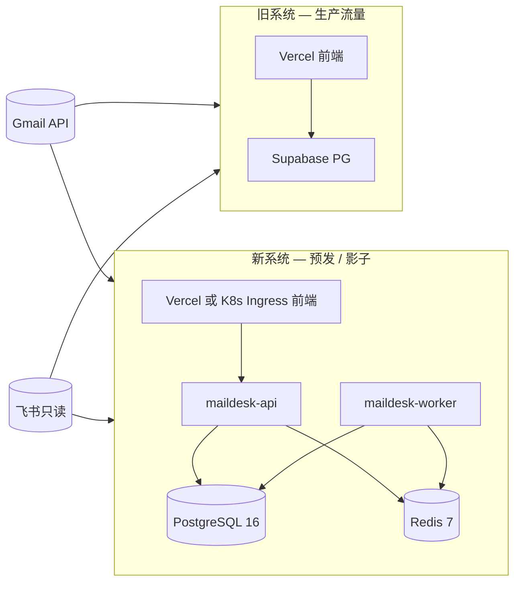

# 双跑 + 切流演练（P6-T11）

> **目标**：在**不切生产流量**的前提下，完整演练「旧 Supabase/Vercel → 新 PG/K8s」迁移与验收路径。  
> **关联**：[`migration/README.md`](../migration/README.md) · [`cutover-runbook.md`](./cutover-runbook.md) · [`rollback-runbook.md`](./rollback-runbook.md) · [`07-risks.md` R11](../../specs/07-risks.md)

---

## 架构：双跑期



| 维度 | 旧系统 | 新系统（双跑） |
|------|--------|----------------|
| 用户流量 | **是** | 否（仅 staging URL / 内测账号） |
| 数据库 | Supabase | 独立 PG（Flyway 已 migrate） |
| Gmail OAuth | 旧 refresh token | 迁移或用户重新授权 |
| 写操作 | 正常 | 预发环境可写；**禁止**与旧库双写同一业务 |

**双跑时长**：切流前 **≥14 天**（`07-risks.md` R8/R11），便于 diff 对比与回滚。

---

## 快速开始：自动化 drill

```bash
cd kol-mail-desk-v2-docs/scripts/cutover
cp env.example .env.cutover
# 填 NEW_API_BASE_URL / MIGRATION_ENV 等

chmod +x dual-run-drill.sh
./dual-run-drill.sh
```

### 环境变量

| 变量 | 说明 |
|------|------|
| `MIGRATION_ENV` | 指向 `migration/.env.migration`（SOURCE/TARGET DB） |
| `NEW_API_BASE_URL` | 新 API 根 URL（如 `https://api-staging.example.com`） |
| `NEW_WEB_BASE_URL` | 新前端 URL（可选） |
| `DRY_RUN_ONLY` | 默认 `true`：只跑检查；`false` 时执行全量 `migrate.sh` |
| `LEGACY_WEB_BASE_URL` | 旧 Vercel URL（人工对照用，脚本不修改） |

### 脚本门禁（自动）

1. **Feature parity**：`05-feature-parity.md` 无残留 `[ ]`（切流硬门禁）
2. **Migration diff**：`migration/diff.sh` 容差内（`06-testing.md §7`）
3. **API health**：`/actuator/health` 200
4. **Manual gates 清单**：Gmail 冒烟、同步、飞书、定时邮件、OAuth、AI（需人工勾选）

退出码 `0` = 自动项通过；**不等于**可以切流，还须完成 manual gates + 业务 sign-off。

---

## 演练阶段（建议排期）

| 阶段 | 时长 | 动作 | 产出 |
|------|------|------|------|
| **D0 预发部署** | 1d | Helm 部署 staging；Flyway；Secrets 注入 | staging API/Web 可访问 |
| **D1 全量迁移 drill** | 0.5d | `DRY_RUN_ONLY=false ./dual-run-drill.sh` | diff 报表归档 |
| **D2–D14 双跑观察** | 2w | 每日 diff；Gmail/飞书同步对比；告警规则 staging 验证 | 双跑日志 |
| **D15 切流 drill** | 0.5d | 按 [`cutover-runbook.md`](./cutover-runbook.md) **dry-run**（不改 DNS） | 演练记录 + RACI 确认 |
| **D16 生产切流** | 窗口 30–60min | 真实切流（另开变更单） | 切流后 diff 绿 |

---

## 双跑期日常检查

```bash
# 每日（或 Worker 异常时）
ENV_FILE=../migration/.env.migration ../migration/diff.sh | tee "diff-$(date +%F).log"

# 阶段映射（可选周度）
psql "$TARGET_DATABASE_URL" -f ../feishu-stage-mapping-audit.sql
```

| 检查项 | 通过标准 |
|--------|----------|
| diff 报表 | 全部 OK，KOL latest gmail_message_id 零容差 |
| Gmail sync 指标 | `gmail.sync.failed` 无持续告警 |
| AI 失败率 | `< 10%`（`maildesk.rules.yml`） |
| dispatch lag | `< 300s` |
| 业务 spot check | 随机 5 个 KOL：阶段 / 最新邮件 / 负责人一致 |

---

## 切流与回滚

- **生产切流步骤**：[`cutover-runbook.md`](./cutover-runbook.md)
- **回滚预案**：[`rollback-runbook.md`](./rollback-runbook.md)（P6-T12）

---

## 相关文档

| 文档 | 用途 |
|------|------|
| [`06-testing.md §7`](../../specs/06-testing.md) | diff 容差定义 |
| [`deploy/k8s/README.md`](../../../kol-mail-desk-v2-backend/deploy/k8s/README.md) | Helm 部署 |
| [`gmail-send-smoke.md`](../gmail-send-smoke.md) | 发信冒烟 |
| [`migration/README.md`](../migration/README.md) | 数据迁移 |
