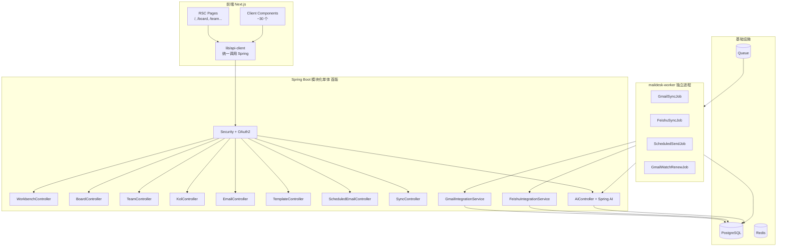
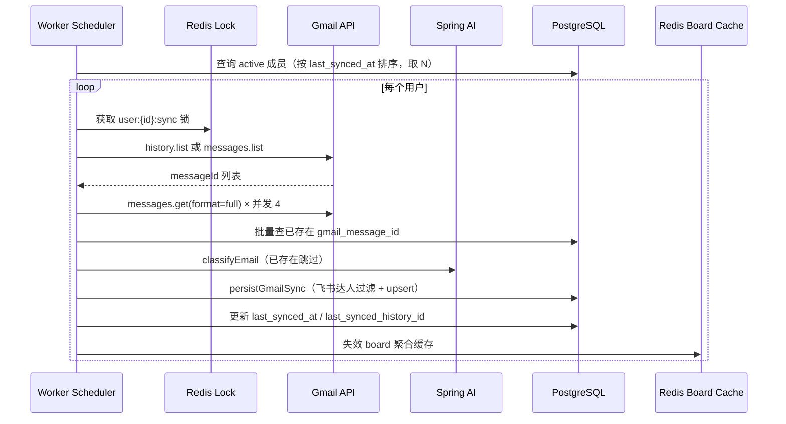
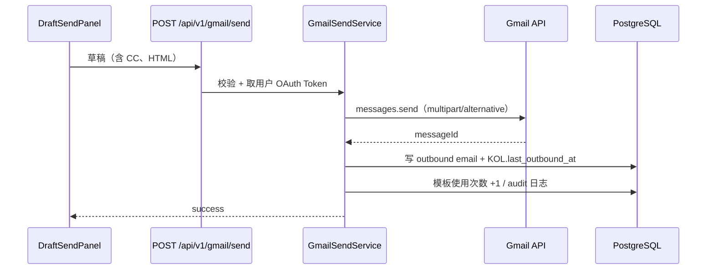
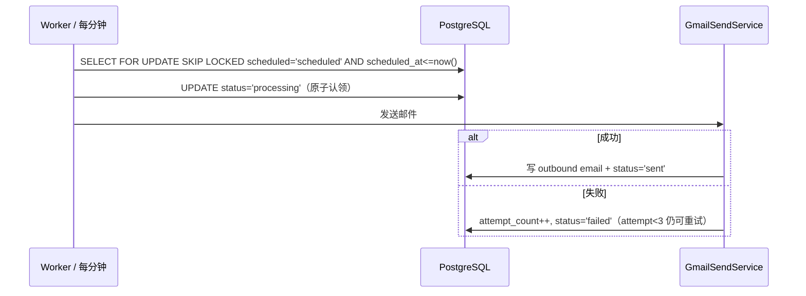

# 系统架构

## 一、技术栈

| 层 | 选型 |
|----|------|
| 前端 | Next.js 15 + React 18 + TypeScript + Tailwind |
| 接入层 | Spring Cloud Gateway（可选）/ Nginx |
| 业务后端 | Spring Boot 3.3 + Java 21 |
| AI 编排 | Spring AI（OpenAI 兼容 → Kimi/Moonshot） |
| 数据库 | PostgreSQL 16 + Flyway |
| 缓存 / 锁 / 限流 | Redis 7 |
| 队列 | Redis Streams（首版）→ Kafka（规模化） |
| 任务调度 | Spring Scheduler + Redis 分布式锁；可选 Temporal |
| 认证 | Spring Security 6 + OAuth2（Google） |
| 对象存储 | S3（附件、导出） |
| 观测 | OpenTelemetry + Prometheus + Grafana + Loki |

## 二、总体架构图



## 三、模块边界与原则

### 3.1 前端 ↔ 后端

- 前端**只**调用 Spring REST（`/api/v1/*`）
- 前端不直接访问 Supabase、Gmail、飞书、AI 任何外部服务
- 前端 SSR 也通过 `lib/api-client/*` 走 Spring（不在前端复制业务逻辑）

### 3.2 后端 ↔ 集成

- Spring 业务层只依赖 `maildesk-domain` 中的接口
- Gmail / 飞书 / AI 实现放在 `maildesk-integration` 与 `maildesk-ai`，通过 Spring DI 注入
- 业务层无法直接 `import com.google.api.*` 或 `import dev.langchain4j.*`

### 3.3 Worker ↔ API

- Worker 是独立 Spring Boot 启动类，共享 `domain` + `infrastructure`
- 任务通过队列下发，**不**通过 HTTP 调用 API
- Worker 失败重试与去重在队列层做（消息 ID + 状态机）

## 四、Maven 模块结构

```
maildesk/
├── maildesk-common/          # DTO、枚举、异常、工具
├── maildesk-domain/          # 实体、Repository 接口、领域规则
├── maildesk-infrastructure/  # MyBatis-Plus 配置 + Mapper XML、Redis、OAuth Token 存储
├── maildesk-integration/
│   ├── gmail/                # Gmail API、解析、发送
│   └── feishu/               # 飞书 Sheet 同步
├── maildesk-ai/              # Spring AI：classify/draft/check/translate
├── maildesk-application/     # 用例服务（ApplicationService）
├── maildesk-api/             # REST Controller、Security（启动类）
└── maildesk-worker/          # 定时任务、队列消费（独立启动类）
```

依赖方向（**只能从上到下**）：

```
api / worker → application → domain
                ↓               ↑
        infrastructure ←  integration / ai
```

ArchUnit 测试守护依赖方向。

## 五、数据流：Gmail 同步



关键不变量（v3.3 保留）：

- 幂等：按 `(gmail_message_id, user_id)` 去重
- **仅飞书登记邮箱才入库**（`source='feishu'` 或 `feishu_record_id` 非空）
- `is_read` 只在 INSERT 时从 Gmail `UNREAD` 标签写入，UPDATE 不覆盖
- 新 inbound 自动清除 `reply_resolved`
- AI 失败不丢邮件，走 `fallbackClassification`
- 历史同步：`last_synced_history_id` 只在全部分页完成后更新

## 六、数据流：发信



## 七、数据流：定时邮件



## 八、多租户预留

虽然首版只为 Lovart 单租户，但 schema 必须预留：

```sql
CREATE TABLE tenants (
  id UUID PRIMARY KEY,
  name TEXT NOT NULL,
  plan TEXT NOT NULL DEFAULT 'lovart_internal',
  created_at TIMESTAMPTZ DEFAULT now()
);

-- 所有业务表都加 tenant_id
ALTER TABLE profiles  ADD COLUMN tenant_id UUID NOT NULL;
ALTER TABLE kols      ADD COLUMN tenant_id UUID NOT NULL;
ALTER TABLE emails    ADD COLUMN tenant_id UUID NOT NULL;
ALTER TABLE email_templates ADD COLUMN tenant_id UUID NOT NULL;
ALTER TABLE scheduled_emails ADD COLUMN tenant_id UUID NOT NULL;
ALTER TABLE actions   ADD COLUMN tenant_id UUID NOT NULL;
```

应用层：

- `TenantContext`（ThreadLocal）由 Spring Security 过滤器在请求开始时设置
- MyBatis-Plus `TenantLineInnerInterceptor` 自动注入 `WHERE tenant_id = ?`，Mapper 无需手写
- PostgreSQL RLS 二期再启用（Phase 7）

## 九、AI 编排

- 入口：`AiService`（Spring Bean）
- 客户端：Spring AI `ChatClient`，`spring.ai.openai.base-url = https://api.moonshot.cn/v1`
- 能力：classify / draft / check / translate
- Prompt：`maildesk-ai/src/main/resources/prompts/*.st`
- 同步链路 AI：通过 Worker 调用，失败有 `fallbackClassification`
- 配额：未来按 tenant 限 token / 请求数（首版预留接口，不强制）

详见 ADR-004。

## 十、稳健性原则

- 邮件同步必须幂等：`(gmail_message_id, user_id)` 唯一键
- KOL upsert 必须按 `(normalized_email, feishu_operator_name)` 去重
- AI 失败不阻塞同步主流程
- 发信前必须有二次确认
- 批量发送串行限流，每封单独记录结果
- 离职处理只改 KOL 状态和 owner，不删除邮件
- 任何写操作必须有 audit 日志

## 十一、部署拓扑

```
┌───────────────┐       ┌─────────────────┐
│  Next.js Web  │──────▶│ Spring API     │
│   (Vercel /   │       │ (K8s / ECS)    │
│   静态)       │       │ HPA 2~6 副本   │
└───────────────┘       └─────────────────┘
                                ▲
                                │
                        ┌───────┴───────┐
                        │ Worker        │
                        │ (K8s)         │
                        │ 1~3 副本      │
                        └───────────────┘
                                │
                ┌───────────────┼───────────────┐
                ▼               ▼               ▼
        ┌──────────────┐ ┌─────────┐ ┌────────────┐
        │ PostgreSQL   │ │ Redis   │ │ S3 / OSS   │
        │ (RDS Multi-  │ │ (单机   │ │ (附件、     │
        │  AZ)        │ │  + 副本)│ │  导出)     │
        └──────────────┘ └─────────┘ └────────────┘
```
