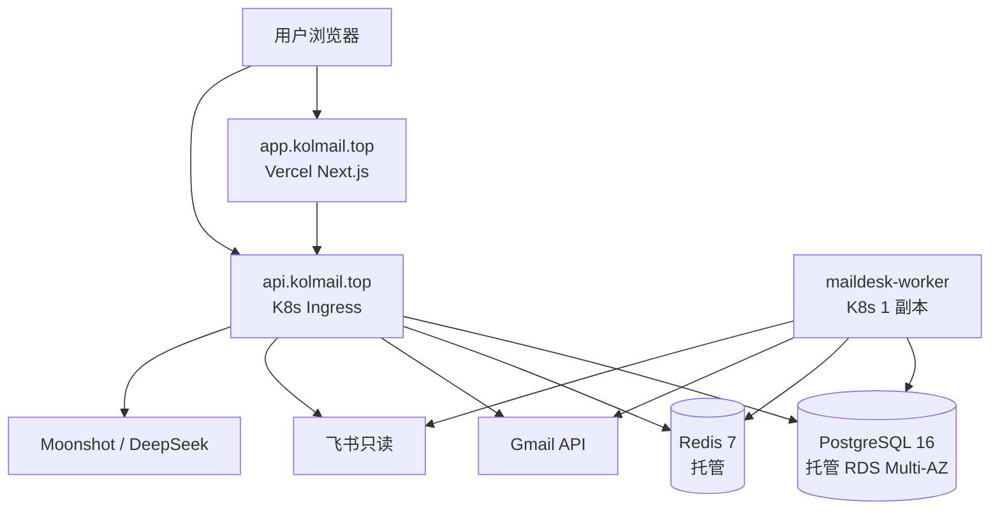

# 生产部署指南（kolmail.top）

> **适用阶段**：Phase 6 完成、本地 v3.3 功能验收通过后。  
> **域名**：`kolmail.top`（`app.` 前端 · `api.` 后端）  
> **容量基线**：约 **200 用户** · **10 万达人** · 邮件 **200 万–500 万** 封  
> **关联**：[`SETUP.md`](./SETUP.md)（本地）· [`scripts/cutover/`](../scripts/cutover/)（双跑/切流）· [`scripts/migration/`](../scripts/migration/)（数据迁移）

---

## 一、目标架构



| 组件 | 部署位置 | 对外暴露 |
|------|----------|----------|
| 前端 | Vercel Production | `app.kolmail.top` |
| API | K8s Deployment + Ingress | `api.kolmail.top` |
| Worker | K8s Deployment | **否**（仅内网 + 出站） |
| PostgreSQL | 托管 RDS / 云 PG | 仅 VPC 内网 |
| Redis | 托管 ElastiCache / 云 Redis | 仅 VPC 内网 |

Worker **必须独立进程**（与 API 分离），负责：Gmail 5min 增量、飞书 30min delta、定时邮件 1min 派发。

---

## 二、域名与 OAuth 配置

### 2.1 DNS 记录

| 主机记录 | 类型 | 指向 | 说明 |
|----------|------|------|------|
| `app` | CNAME | Vercel 分配的域名 | 前端 |
| `api` | CNAME / A | K8s Ingress LB 地址 | 后端 API + OAuth 回调 |

> 切流前可先让 staging 与生产共用子域，或另设 `staging.kolmail.top` / `api-staging.kolmail.top` 做双跑。

### 2.2 Google Cloud OAuth

在 [GCP Console → OAuth consent](https://console.cloud.google.com/apis/credentials) 配置：

| 项 | 值 |
|----|-----|
| Authorized JavaScript origins | `https://app.kolmail.top` |
| Authorized redirect URIs | `https://api.kolmail.top/login/oauth2/code/google` |

Gmail API 需在项目中启用；未 Publish 前，Test users 白名单需包含全部内测账号（见 `F-AUTH-03`）。

### 2.3 后端 / 前端环境变量

| 位置 | 变量 | 示例值 |
|------|------|--------|
| Helm `config.*` | `corsAllowedOrigins` | `https://app.kolmail.top` |
| Helm `config.*` | `webRedirectUrl` | `https://app.kolmail.top/` |
| Vercel | `NEXT_PUBLIC_API_BASE_URL` | `https://api.kolmail.top` |
| Secrets Manager | 见 [`deploy/secrets/README.md`](../../kol-mail-desk-v2-backend/deploy/secrets/README.md) | JSON `maildesk/prod` |

---

## 三、部署流程总览

```
阶段 0  云账号 / 镜像 / Secrets / DNS 准备          （1–2 天）
   ↓
阶段 1  Staging 部署 + 冒烟                         （D0，约 1 天）
   ↓
阶段 2  数据迁移 + 双跑观察                         （D1–D14，约 2 周）
   ↓
阶段 3  生产切流                                    （D16，窗口 30–60 min）
```

详细切流时间线见 [`scripts/cutover/cutover-runbook.md`](../scripts/cutover/cutover-runbook.md)。  
双跑 drill 见 [`scripts/cutover/README.md`](../scripts/cutover/README.md)。

---

## 四、阶段 0：前置准备（1–2 天）

### 4.1 云资源清单

| 资源 | 用途 | 备注 |
|------|------|------|
| 容器镜像仓库 | GHCR / ECR / ACR | CI 构建 `maildesk-api`、`maildesk-worker` |
| K8s 集群 | 运行 API + Worker | 建议香港 / 新加坡（访问 Google API） |
| PostgreSQL 16 | 业务库 | Flyway 由 API 首次启动执行 |
| Redis 7 | Session + 分布式锁 + 缓存 | |
| Secrets Manager | 生产密钥 | AWS SM / GCP SM，经 ESO 同步到 K8s |
| Vercel 项目 | 前端托管 | 连接 `kol-mail-desk-v2-web` 仓库 |
| （可选）S3 / OSS | 附件、导出 | Phase 6 首版可选 |

### 4.2 外部账号

与 [`SETUP.md` §3](./SETUP.md) 一致，生产环境需全部就绪：

- Google OAuth Client ID/Secret + Gmail API
- 飞书 App ID/Secret + KOL Sheet Token
- Moonshot（及可选 DeepSeek）API Key
- `TOKEN_ENCRYPTION_KEY`：`openssl rand -base64 32`

密钥模板：[`maildesk-prod.secret.json.example`](../../kol-mail-desk-v2-backend/deploy/secrets/maildesk-prod.secret.json.example)

### 4.3 CI 镜像构建

后端仓库已含 `Dockerfile` 与 `.github/workflows/backend-ci.yml`。生产需：

1. CI 构建并 push 镜像到 registry
2. Helm `values-prod` 中设置 `global.imageRegistry` 与 `api/worker.image.tag`

---

## 五、阶段 1：Staging 部署（D0）

### 5.1 创建数据库与 Redis

```bash
# PostgreSQL 16 — 空库 maildesk，开启自动备份 7–14 天
# Redis 7 — 启用 AUTH（密码写入 Secrets Manager）
```

API 首次启动时 Flyway 自动执行 `V1`～`V17` 迁移。

### 5.2 安装 External Secrets Operator（若用 AWS SM）

```bash
helm repo add external-secrets https://charts.external-secrets.io
helm upgrade --install external-secrets external-secrets/external-secrets \
  -n external-secrets --create-namespace
```

完整步骤：[`deploy/secrets/README.md`](../../kol-mail-desk-v2-backend/deploy/secrets/README.md)

### 5.3 Helm 部署 API + Worker

```bash
cd kol-mail-desk-v2-backend

helm lint deploy/helm/maildesk \
  -f deploy/helm/maildesk/values-prod.example.yaml \
  --set database.host=<RDS_ENDPOINT> \
  --set redis.host=<REDIS_ENDPOINT> \
  --set config.corsAllowedOrigins=https://app.kolmail.top \
  --set config.webRedirectUrl=https://app.kolmail.top/

helm upgrade --install maildesk deploy/helm/maildesk \
  --namespace maildesk --create-namespace \
  -f deploy/helm/maildesk/values-prod.example.yaml \
  --set global.imageRegistry=ghcr.io/your-org \
  --set api.image.tag=0.1.0 \
  --set worker.image.tag=0.1.0 \
  --set database.host=<RDS_ENDPOINT> \
  --set redis.host=<REDIS_ENDPOINT> \
  --set config.corsAllowedOrigins=https://app.kolmail.top \
  --set config.webRedirectUrl=https://app.kolmail.top/ \
  --set ingress.enabled=true \
  --set ingress.hosts[0].host=api.kolmail.top
```

验证：

```bash
curl -sf https://api.kolmail.top/actuator/health
# 期望 HTTP 200
```

Helm 细节：[`deploy/k8s/README.md`](../../kol-mail-desk-v2-backend/deploy/k8s/README.md)

### 5.4 Vercel 部署前端

1. Import `kol-mail-desk-v2-web` 仓库
2. Production 域名：`app.kolmail.top`
3. 环境变量：`NEXT_PUBLIC_API_BASE_URL=https://api.kolmail.top`
4. Deploy 后验证：打开 `/login` → Google OAuth → 进入工作台

### 5.5 Staging 冒烟清单

| # | 项 | 通过标准 |
|---|-----|----------|
| 1 | Google 登录 | OAuth 回调成功，`integration_credentials` 有加密 token |
| 2 | Gmail 历史/增量同步 | 202 + 进度完成 |
| 3 | 飞书同步 | KOL 数量合理 |
| 4 | 手动发信 | [`gmail-send-smoke.md`](../scripts/gmail-send-smoke.md) |
| 5 | 定时邮件 | 创建 5min 后 → `sent`（Worker 必须在跑） |
| 6 | AI 四能力 | classify / draft / check / translate 各 1 次 |

---

## 六、阶段 2：数据迁移 + 双跑（D1–D14）

### 6.1 全量迁移

```bash
cd kol-mail-desk-v2-docs/scripts/migration
cp env.example .env.migration
# 填 SOURCE_DATABASE_URL（旧 Supabase）、TARGET_DATABASE_URL（新 RDS）

./migrate.sh
./migrate-google-credentials.sh   # OAuth token 加密迁移（可选）
./diff.sh | tee diff-staging.log    # 必须 exit 0
```

容差定义：[`06-testing.md` §7](./06-testing.md)

### 6.2 自动化门禁

```bash
cd kol-mail-desk-v2-docs/scripts/cutover
cp env.example .env.cutover
# NEW_API_BASE_URL=https://api.kolmail.top

./dual-run-drill.sh
```

### 6.3 双跑期日常（建议每日）

```bash
ENV_FILE=../migration/.env.migration ../migration/diff.sh | tee "diff-$(date +%F).log"
```

| 检查项 | 通过标准 |
|--------|----------|
| diff 报表 | 全部 OK；KOL latest `gmail_message_id` 零容差 |
| Gmail sync | Prometheus `gmail.sync.failed` 无持续告警 |
| AI 失败率 | < 10% |
| 定时邮件 lag | < 300s |
| 业务 spot check | 随机 5 个 KOL：阶段 / 最新邮件 / 负责人一致 |

**双跑时长**：切流前 **≥14 天**（见 [`07-risks.md` R11](./07-risks.md)）。

---

## 七、阶段 3：生产切流（D16）

维护窗口建议：**UTC+8 02:00–04:00**，时长 **30–60 分钟**。

| 时间 | 动作 |
|------|------|
| T-30min | 冻结变更；确认 Supabase PITR / 备份 |
| T-10min | 旧系统禁写（或业务确认无人操作） |
| T0 | 最终 `migrate.sh` + `diff.sh`（必须绿） |
| T+5min | DNS：`api.kolmail.top` → 新 Ingress；验证 health |
| T+10min | Vercel Production 切到新前端；验证 OAuth |
| T+15min | 生产冒烟（登录 / 同步 / 发信 / 定时 / AI） |
| T+30min | 业务 sign-off；监控 24h |

完整步骤与 RACI：[`cutover-runbook.md`](../scripts/cutover/cutover-runbook.md)  
回滚：[`rollback-runbook.md`](../scripts/cutover/rollback-runbook.md)

---

## 八、服务器配置建议

### 8.1 容量估算（200 用户 · 10 万达人）

| 维度 | 估算 | 说明 |
|------|------|------|
| 并发用户 | 20–50 峰值 | 200 注册用户，非全员同时在线 |
| KOL 行数 | 10 万 | 飞书 + Gmail 同步 |
| 邮件行数 | 200 万–500 万 | 按每 KOL 20–50 封；含 HTML 正文 |
| DB 磁盘 | **80–150 GB**（建议预留 **300 GB**） | 含索引与增长 |
| Gmail 同步负载 | 200 用户 × 每 5 分钟 | Worker 单副本 + Redis 锁 |

### 8.2 生产推荐配置（托管服务）

#### 方案 A：标准生产（推荐）

| 组件 | 规格 | 数量 | 说明 |
|------|------|------|------|
| **PostgreSQL 16** | 4 vCPU / 16 GB / **300 GB SSD** | 1 主 + 1 备 | AWS `db.r6g.xlarge` 或同等；Multi-AZ；自动备份 7–14 天 |
| **Redis 7** | 2 GB 内存 | 1 主 + 1 副本 | Session + 分布式锁 |
| **K8s 节点** | 4 vCPU / 8 GB | **3 节点** | 应用层高可用 |
| **API Pod** | req 512Mi / 0.25 CPU · limit 1Gi / 2 CPU | **2 副本**，HPA 2→6 | Helm 默认 |
| **Worker Pod** | req 512Mi / 0.25 CPU · limit 1Gi / 2 CPU | **1 副本** | 勿随意扩多副本（见 [`07-risks.md` R7](./07-risks.md)） |
| **Ingress / LB** | HTTPS 终止 | 1 | 可选 WAF |
| **Vercel** | Pro | — | 前端 SSR + 静态 |
| **监控** | Prometheus + Grafana | — | `--set alerts.enabled=true` |

K8s 应用层合计约 **12 vCPU / 24 GB**；数据库与 Redis 独立托管。

#### 方案 B：Staging / 预发（降配）

| 组件 | 规格 |
|------|------|
| PostgreSQL | 2 vCPU / 8 GB / 100 GB |
| Redis | 1 GB |
| K8s | 2 节点 × 2 vCPU / 4 GB |
| API | 1 副本 |
| Worker | 1 副本 |

### 8.3 区域与网络

- **区域**：香港 / 新加坡（Gmail、Moonshot 延迟较低）
- **出站**：Worker 需稳定访问 `gmail.googleapis.com`、飞书 API、Moonshot API；若大陆机房需配置出站代理
- **入站**：仅 `443`（API Ingress）；Worker 不暴露公网
- **SSL**：Ingress 或云 LB 挂证书（Let's Encrypt / 云证书）

### 8.4 10 万达人规模调优要点

1. **PostgreSQL**
   - 建议 RDS Proxy 或 PgBouncer 连接池
   - 监控慢查询（工作台 `?q=` ILIKE 搜索）
   - 后期可按 `sent_at` 对 `emails` 分区（Phase 7 可选）

2. **Redis**
   - 200 用户 Session，1–2 GB 足够

3. **Worker**
   - Gmail 5min × 200 用户 ≈ 每轮 200 次 API；单 Worker 可承受
   - 同步 backlog 大时可临时调快 cron 或增加出站带宽

4. **API HPA**
   - CPU 70% 触发；日常 2 副本，批量发信高峰可扩至 4–6

---

## 九、部署检查清单

### Staging 上线前

- [ ] RDS + Redis 已创建，Flyway 迁移成功
- [ ] Secrets Manager 已写入，`verify-k8s-secret.sh` 通过
- [ ] Helm deploy 成功，`/actuator/health` 200
- [ ] DNS `api.kolmail.top` / `app.kolmail.top` 已解析
- [ ] GCP OAuth redirect / origins 已配置
- [ ] Vercel `NEXT_PUBLIC_API_BASE_URL` 正确
- [ ] Staging 冒烟全通过（§5.5）

### 切流前

- [ ] `dual-run-drill.sh` PASS
- [ ] `diff.sh` 连续 7 天绿
- [ ] [`05-feature-parity.md`](./05-feature-parity.md) 无 `[ ]`
- [ ] Prometheus 告警已部署（`deploy/prometheus/alerts/maildesk.rules.yml`）
- [ ] 回滚 Runbook 已读，RACI 已指定
- [ ] 业务公告维护窗口

---

## 十、相关文档索引

| 文档 | 路径 |
|------|------|
| 本地开发 | [`SETUP.md`](./SETUP.md) |
| K8s / Helm | [`deploy/k8s/README.md`](../../kol-mail-desk-v2-backend/deploy/k8s/README.md) |
| 生产 Helm values | [`values-prod.example.yaml`](../../kol-mail-desk-v2-backend/deploy/helm/maildesk/values-prod.example.yaml) |
| 密钥管理 | [`deploy/secrets/README.md`](../../kol-mail-desk-v2-backend/deploy/secrets/README.md) |
| 数据迁移 | [`scripts/migration/README.md`](../scripts/migration/README.md) |
| 双跑 / 切流 | [`scripts/cutover/README.md`](../scripts/cutover/README.md) |
| 切流 Runbook | [`scripts/cutover/cutover-runbook.md`](../scripts/cutover/cutover-runbook.md) |
| 回滚 Runbook | [`scripts/cutover/rollback-runbook.md`](../scripts/cutover/rollback-runbook.md) |
| Gmail 发信冒烟 | [`scripts/gmail-send-smoke.md`](../scripts/gmail-send-smoke.md) |
| 架构拓扑 | [`01-architecture.md` §11](./01-architecture.md) |
| 验收工作表 | [`PARITY-ACCEPTANCE-WORKSHEET.md`](./PARITY-ACCEPTANCE-WORKSHEET.md) |

---

## 变更记录

| 日期 | 说明 |
|------|------|
| 2026-07-05 | 初版：kolmail.top 部署流程 + 200 用户 / 10 万达人容量基线 |
